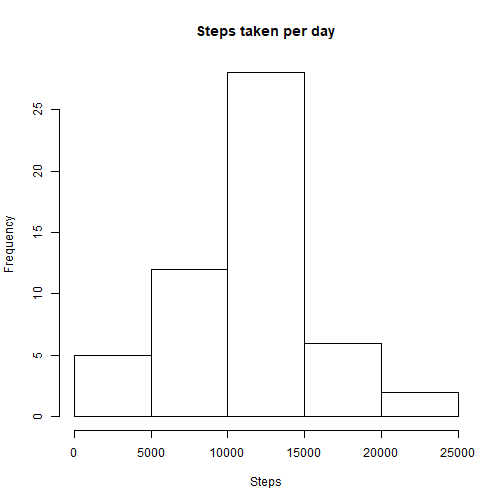
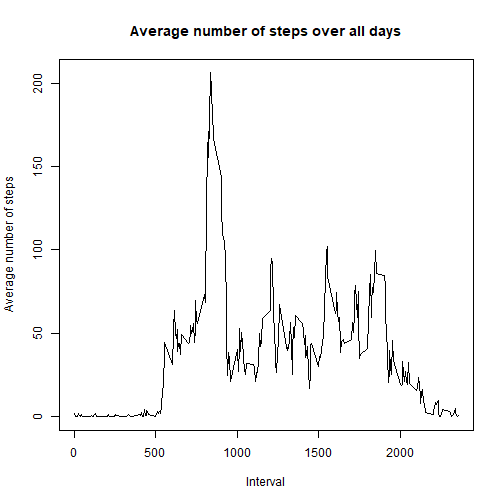
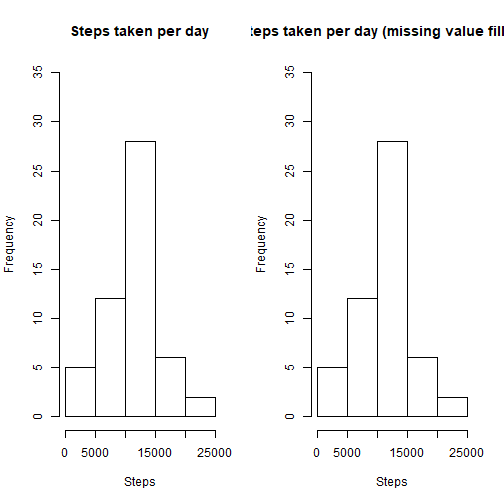
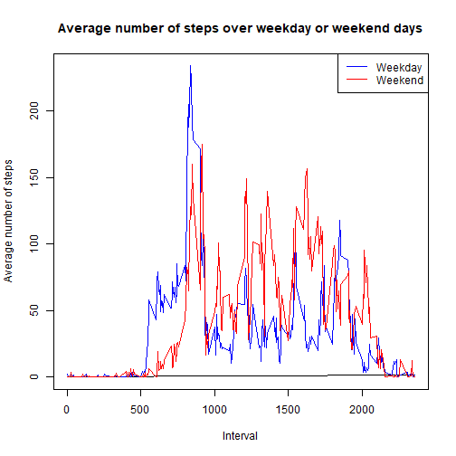
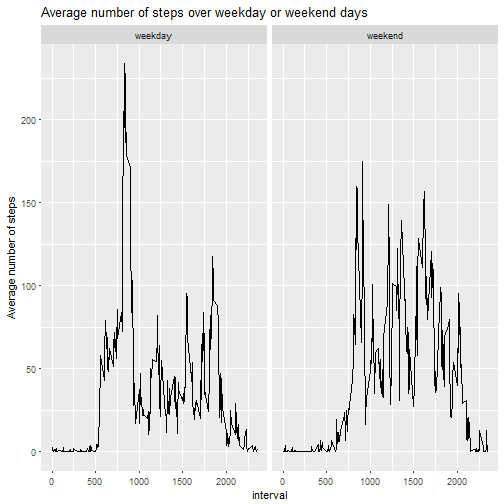

```r
# Load package
library(dplyr)
library(ggplot2)
library(knitr)


setwd("D:\\projetos\\data-science\\Reproducible Research\\week2")

# Load data
if(!exists("NEI")){
  AM <- read.csv("activity.csv")
}

####  What is mean total number of steps taken per day? #####
# Remove NA from data
AM1 <- AM[!(is.na(AM$steps)),]
head(AM1,10)
```

```
##     steps       date interval
## 289     0 2012-10-02        0
## 290     0 2012-10-02        5
## 291     0 2012-10-02       10
## 292     0 2012-10-02       15
## 293     0 2012-10-02       20
## 294     0 2012-10-02       25
## 295     0 2012-10-02       30
## 296     0 2012-10-02       35
## 297     0 2012-10-02       40
## 298     0 2012-10-02       45
```

```r
## Calculate the total number of steps taken per day
g <- group_by(AM1, date)
step_day <- summarise(g, total = sum(steps))
step_day
```

```
## # A tibble: 53 x 2
##    date       total
##    <fct>      <int>
##  1 2012-10-02   126
##  2 2012-10-03 11352
##  3 2012-10-04 12116
##  4 2012-10-05 13294
##  5 2012-10-06 15420
##  6 2012-10-07 11015
##  7 2012-10-09 12811
##  8 2012-10-10  9900
##  9 2012-10-11 10304
## 10 2012-10-12 17382
## # ... with 43 more rows
```

```r
# Histogram of the total number of steps taken each day
hist(step_day$total, main = "Steps taken per day", xlab = "Steps")
```



```r
# Mean and median number of steps taken each day
summary(step_day)
```

```
##          date        total      
##  2012-10-02: 1   Min.   :   41  
##  2012-10-03: 1   1st Qu.: 8841  
##  2012-10-04: 1   Median :10765  
##  2012-10-05: 1   Mean   :10766  
##  2012-10-06: 1   3rd Qu.:13294  
##  2012-10-07: 1   Max.   :21194  
##  (Other)   :47
```

```r
#### What is the average daily activity pattern? ####
# steps by interval
si <- aggregate(steps ~ interval, AM1, mean)

# plot 
plot(si$interval, si$steps, type='l', 
     main="Average number of steps over all days", xlab="Interval", 
     ylab="Average number of steps")
```



```r
#### Imputing missing values ####
# 1. Calculate and report the total number of missing values in the dataset 
# (i.e. the total number of rows with s)
row.na <- nrow(AM[is.na(AM),])
row.na
```

```
## [1] 2304
```

```r
# 2.  Devise a strategy for filling in all of the missing values in the dataset. 
# The strategy does not need to be sophisticated. For example, you could use 
# the mean/median for that day, or the mean for that 5-minute interval, etc.
newAM <- AM
for(i in 1:nrow(newAM))
  {
    if (is.na(dt$steps[i])) {
      newAM$steps[i] <- si[si$interval == newAM$interval[i],]$steps 
  }
}

# 3. Create a new dataset that is equal to the original dataset but with the missing 
# data filled in.
head(newAM)
```

```
##   steps       date interval
## 1    NA 2012-10-01        0
## 2    NA 2012-10-01        5
## 3    NA 2012-10-01       10
## 4    NA 2012-10-01       15
## 5    NA 2012-10-01       20
## 6    NA 2012-10-01       25
```

```r
# 4. Make a histogram of the total number of steps taken each day and Calculate and report 
# the mean and median total number of steps taken per day. Do these values differ from the 
# estimates from the first part of the assignment? What is the impact of imputing missing 
# data on the estimates of the total daily number of steps?

# Calculate the total number of steps taken per day (missing value filled in)
new_g <- group_by(newAM, date)
new_step_day <- summarise(new_g, total = sum(steps))
new_step_day
```

```
## # A tibble: 61 x 2
##    date       total
##    <fct>      <int>
##  1 2012-10-01    NA
##  2 2012-10-02   126
##  3 2012-10-03 11352
##  4 2012-10-04 12116
##  5 2012-10-05 13294
##  6 2012-10-06 15420
##  7 2012-10-07 11015
##  8 2012-10-08    NA
##  9 2012-10-09 12811
## 10 2012-10-10  9900
## # ... with 51 more rows
```

```r
# Histogram of the total number of steps taken each day (missing value filled in)
hist(new_step_day$total, main = "Steps taken per day", xlab = "Steps")
```


```r
# Mean and median number of steps taken each day
summary(new_step_day)
```

```
##          date        total      
##  2012-10-01: 1   Min.   :   41  
##  2012-10-02: 1   1st Qu.: 8841  
##  2012-10-03: 1   Median :10765  
##  2012-10-04: 1   Mean   :10766  
##  2012-10-05: 1   3rd Qu.:13294  
##  2012-10-06: 1   Max.   :21194  
##  (Other)   :55   NA's   :8
```

```r
#compare both
par(mfrow = c(1,2))
rng <- c(0,35)
hist(step_day$total, main = "Steps taken per day", xlab = "Steps", ylim = rng)
hist(new_step_day$total, main = "Steps taken per day (missing value filled in)", xlab = "Steps", ylim = rng)
```



```r
#### Are there differences in activity patterns between weekdays and weekends? ####
# Create a new factor variable in the dataset with two levels - "weekday" and "weekend" 
# indicating whether a given date is a weekday or weekend day.
Sys.setlocale("LC_TIME","English")
```

```
## [1] "English_United States.1252"
```

```r
newAM$week <- weekdays(as.Date(newAM$date), abbreviate = TRUE)
newAM$week[newAM$week %in% c("Mon","Tue","Wed","Thu","Fri")] <- "weekday"
newAM$week[newAM$week %in% c("Sat","Sun")] <- "weekend"
head(newAM)
```

```
##   steps       date interval    week
## 1    NA 2012-10-01        0 weekday
## 2    NA 2012-10-01        5 weekday
## 3    NA 2012-10-01       10 weekday
## 4    NA 2012-10-01       15 weekday
## 5    NA 2012-10-01       20 weekday
## 6    NA 2012-10-01       25 weekday
```

```r
# steps by interval
si <- aggregate(steps ~ interval + week, newAM, mean)

# plot 
par(mfrow = c(1,1))
plot(si$interval, si$steps, type='l', 
     main="Average number of steps over weekday or weekend days", xlab="Interval", 
     ylab="Average number of steps")
with(subset(si, week == "weekday"), points(interval, steps, col = "blue", type = "l"))
with(subset(si, week == "weekend"), points(interval, steps, col = "red", type = "l"))
legend("topright", col = c("blue", "red"), legend = c("Weekday", "Weekend"), lty = 1)
```



```r
# alternative plot
qplot(interval, steps, data = si, facets = .~week, geom = "line",
      main="Average number of steps over weekday or weekend days",
      ylab="Average number of steps")
```


